# 大数据分析技术Project 1实验报告

16307130086 何畅扬		16307130138 常朝坤

## 一、 概述

本次project的主题为基于kdd13_Scalable All-Pairs Similarity Search in Metric Spaces的Similarity
search，并在真实的分布式集群上进行测试。分治法的思想在本项目中有很好的体现。

## 二、 项目目标

从一个具有K个样本点的样本集中，选择样本间距为r以内的所有pairs并输出。

## 三、 符号表示

1. P：点
2. C：圆心
3. R：半径
4. S：点集（workset）
5. r：样本间距
6. Inner pairs：由一个点集的inner点间计算出的pairs
7. Inner to Outer pairs：由一个点集的inner与outer点间计算出的pairs

## 四、 项目结构

| 项目结构                                     | 核心源码                                     |
| -------------------------------------------- | -------------------------------------------- |
| 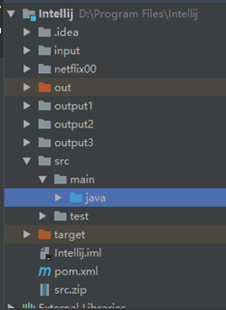 | 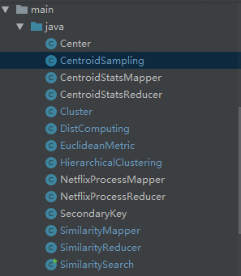 |

左图所示为整体的结构，其可用于本地调试。右图展示了源码的架构，各个文件的命名直接与其功能相关，其中SimilaritySearch为最终的运行主类。

## 五、 项目细节

### 1. Centroid Sampling

首先对一个样本集，我们需要产生n个中心点。论文中列举了random sampling， KMeans++及seeding approach等方法，从结果看前两者效率较高，故我们选择了random sampling的方式进行中心点的产生。值得注意的是，各个中心点之间的距离需要满足大于r，否则会产生结果的重叠。

### 2. Centroid Stats

此阶段的主要目的是得到每个中心点的半径。

#### setup

载入sampling阶段产生的中心点位置

实现方式：对于（1）的结果，我们将其包装成一个字符串（每个中心点之间按照\t隔开），main函数中得到结果之后将其存入configuration中，如下图所示：

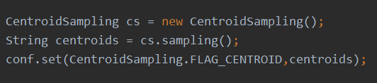

在setup函数里，通过从configuration中读出字符串并解包装，就能够得到所有的中心点。

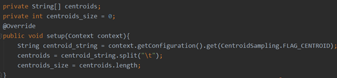

#### map

```
input : key:offset		value:Px’s position
output: key: Ci		value :dist<Ci,Px>
```

从样本集加载点Px作为input，对所有中心点做一遍遍历，寻找最近的中心点Ci，成为Si的inner元素，并输出
Px与Ci距离。

#### reduce

```
Input:  key: Ci 		value:list<dist<Ci,Px>>
output: key:Ci#Ri		value :Null
```

此处，我们找到了以Ci为中心点的集合Si的所有点，这些点距离Ci的信息被存储在value的list中。我们对list做一遍遍历，找到集合内距离圆心最远的点离圆心的距离(即value的最大值)作为此中心点的半径，并以Ci，Ri间距离为输出。

### 3. Similarity Mapper

#### setup

读取CentroidStats阶段的输出（即各点圆心及半径）。同样地，在上一阶段执行结束后，通过一个函数将圆心及半径信息读入字符串，通过conf传递，在此不做赘述。

#### map

```
input : key:offset		value:Px’s position
output: key: Ci#Ri		value :Px#pointType#dist<Px,Ci>
```

此阶段，我们主要对每个点做集合的归类，从而得到各集合完善的内部点信息。首先，我们读入点Px，找到Px最近的圆心点Ci，将Px标记为Ci的inner类型点并输出；再找到所有距离在Rj+r范围内的圆心Cj, 将Px标记为Cj的outer类型点并输出。在对所有点进行一遍遍历之后，我们就能够得到每个以Ci为圆心的点集Si的所有inner与outer点。

#### reduce

```
input : key: Ci#Ri		value :list<Px#pointType#dist<Px,Ci>>
output: key: Px,Py		value :Null
```

对每个以Ci为圆心的点集Si，我们对所有内部点做如下处理：

Inner与inner逐个匹配，若距离小于r，则输出。（复杂度O(n2)）

inner与outer逐个匹配，若距离小于r，则输出。（复杂度O(n2)）；

不用对outer间做逐一匹配的原因是若两个outer在此点集中距离小于r，它们必然会在另一个点集中互为inner/inner或inner/outer关系。

这样的做法保证了对所有距离为r之内pairs的包含，但是具有两大缺点：

- 复杂度高，效率低
- 存在冗余

针对前者，我们在compression里进行优化；对于后者，我们在exploting commutativity进行优化。

### 4. Exploting commutativity

这一阶段的优化目标为去除所有冗余的pairs。

由于各个点集的inner点互不重叠，故不存在Inner pairs的冗余；但Inner to Outer pairs必然存在冗余。该证明在论文中未提及，故在此处特别说明：

证明：设集合Sa存在Inner点P1与Outer点P2，两者构成Inner to Outer pairs，则两点间距离必小于r；故对P2所在集合Sb，dist<P1,Cb> <= dist<P2,Cb>+r <=Rb + r，即P1必属于Sb的outer点。故对Sb内所有点做运算时，P1与P2也必然作为Inner to Outer pairs考虑再其中。

这种情况下，优化方式显而易见：二选一。论文通过 (((Pi.id + Pj.id) is odd) XOR (Pi.id < Pj.id))为真，则将Pi归入Sj的outer，不将Pj归入Si的outer的方式实现。该方法在“二选一”的正确性上显然。

### 5. Compression of pairs

在寻找相似pairs的过程中，对于比较集中的数据集或数据的子集，我们实际上可以换一种描述方式表示集合中的pairs。论文中提到了一种高效的描述方式——基于拓扑的描述方式，本次项目以其为基础进行了实现。

本项目中选取了三种拓扑结构进行压缩，分别是Clique，Biclique，Hub。其中clique拓扑的压缩率时最大的，biclique次之，本项目中的hub等同于无压缩输出（这与选取的粒度相关）。

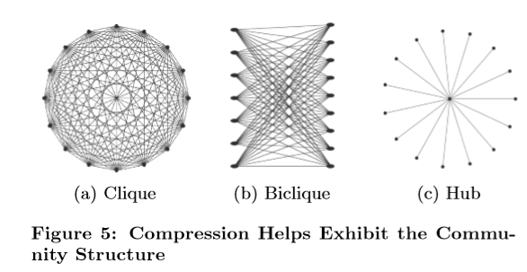

为了构建三种拓扑结构，项目设计过程中采用了层次聚类的方法，层级聚类的实现使用了二叉树结构。层次聚类的聚类条件是Flexible的，本项目中将距离最近的两个点集进行聚类。对于两个点集距离的衡量，项目使用了质心作为代表进行运算。有关层次聚类建立的原理和过程此处不做详细介绍，详情可参考代码。

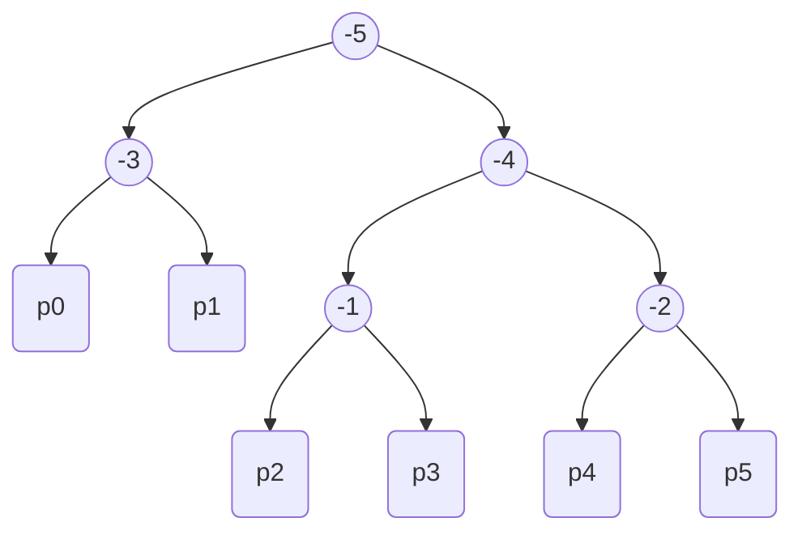

二叉树建立好后，递归遍历每一个非叶子节点，检查该节点的两个子节点能否组成一对压缩结构。检查的过程也是个递归过程，如果该层不能构成，则检查其子集是否可能构建起压缩结构（即考察叶子节点和叶子节点，叶子节点和父节点的兄弟节点之间的关系），一直遍历到叶子节点上，直接输出一个pairs。可以证明，这并不会有重复的计算。

需要注意的是，由于层次聚类树的建立过程中没有考虑inner和outer的区别，所以此处会造成结果的较大冗余，严重的情况下，甚至会导致压缩后的结果比压缩前还要大。可选的解决方案是，支队inner的点建立层次聚类结构，inner和outer之间仍然按照之前的方式计算和输出。

### 6. Repartition

Repartition主要针对两种情况设立：

- 点集分配不均匀的短板效应，某些点集跑很久而其它点集很快跑完，影响总效率

- 某些点集很大，占用大量的内存空间

因此，我们需要在预估计算次数上限，来判断是否需要进行repartition

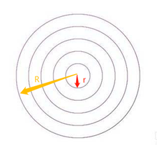

如上图所示，我们在SimilarityMapper阶段将每个半径为R的Workset划分为半径为r的圆环。若两个点构成距离为r以内的pairs，它们或在同一圆环内，或在相邻圆环上；因此，统计每个圆环内的点数，并对各圆环点数平方及相邻圆环点数积求和，即可预估比较次数的上限。
若上限大于某一阈值，则将key: Ci  `value :list<Px#pointType#dist<Px,Ci>>`原封不动输出到待处理文件中，并将Ci，Ri添加到缓存文件；否则，按原步骤处理。

进入Repartition后，对缓存文件中每个Ci对应的工作集Si以类似CentroidSampling阶段产生一系列小中心点CCi。接着，对原工作集 Wi(半径为Ri)中的inner点P找最近的中心点CCi，算作CCi的inner；找距离在R1+t的点CCj,算作CCj的outer。后续介绍的SecondaryKey的引入，保证了所有inner点可以在outer点之前进入，这样在处理outer时，我们已经确定了每个CCi的半径。对所有的outer点，我们找最近的中心点CCi，算作CCi的inner；找距离在Rj+t内的点CCj,算作CCj的outer。至此，新的workset已经建立。

Repartition的reduce阶段，按类似于SimilarityMapper中的reduce阶段类似进行，不做赘述。

### 7. Secondary Key

SecondaryKey对于Reuce负载的调节具有重要作用，其主要用途是保证shuffle阶段的分组按照用户自定义的标准进行，并且保证Reduce的输入按照用户所想要的顺序进行排列。本次项目中，通过SecondaryKey的设计，保证了inner和outer进入同一个reduce的同时，保证所有的inner点出现在outer点之前（这里的“所有”所指的范围为一个workset）。实现方法如下：

- 构造自定义数据类 BigKey：包含两个成员变量`firstKey和secondKey `
- 重写Partitioner方法，按照fisrtKey分区
- 重写WritableComparator方法，按照firstKey比较

## 六、 集群搭建

#### 集群配置:

- Linux版本：Ret Hat4.8.5
- jdk版本：jdk1.8.0_191
- hadoop版本：hadoop-2.8.5
- zookeeper版本：zookeeper.3.5.4-beta

本项目在5台虚拟机上搭建了Hadoop分布式集群，用于测试前述所实现工程。集群通过zookeeper等设置解决了单点故障问题，增强了集群的容错性。由于虚拟机自身问题，节点data4运行速度极慢，为保证集群稳定性，该节点被手动移除。主从节点服务如下表：

| 主节点                                       | Secondary Name Node                          | 从属节点                                     |
| -------------------------------------------- | -------------------------------------------- | -------------------------------------------- |
| 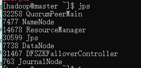 | 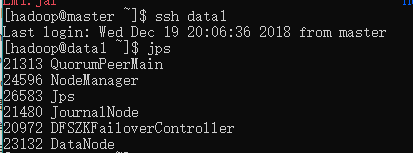 | 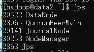 |

## 七、 结果与分析

### 1. 数据

数据1：随机点（2维，3维，7维，20维等），最大的测试数据大小维2GB的7维数据。

数据2：处理后的Netflix price数据。使用mapreduce进行了数据的清洗，得到了7GB的数据。数据内容为一个用户对所有电影的观看情况(有评分记录则认为看过，没有评分记录则认为没有看过)

### 2. 效果

对于MB级别的数据，算法模型表现良好，运算时间大概在1-2h级(最主要的限制在于第一步中的分区过程计算量较大)。而对于GB级的数据，5个节点的集群已经无法在可接受的时间内处理。

### 3. 压缩

本项目所设计的压缩策略会随着数据量的增大而更好，由于测试的数据集比较小，所以压缩效果不是很显著，但是可以看到，压缩确实可以减小输出的条数。

## 八、 问题分析

### 1. 随机点生成瓶颈

对数据进行测试时，发现随机生成中心点对程序性能有一定的限制，由于随机生成是在单机上运行的，一旦生成的随机点个数过多，就会导致运行速度过慢，在5个单位大小的7维空间中生成10000个满足条件（间隔不小于0.01）的随机点集需要花费6min左右。其原因在于随机点个数一旦增多，发生“碰撞”概率就会增大，算法为了避免碰撞而花费了巨大的代价。如果数据量更大，那么生成的速度会更慢，且速度的降低是非线性的。如果将随机点个数调小一些，那么就有可能会造成分区过大，造成reduce阶段溢出，需要引入repartition机制。

提高随机点生成速度的方法，可以采用分区法，类似于寻找pairs的思想，将随机点生成的任务分配到若干相互不会影响的子区间内生成，以减少碰撞的概率。

中心点

另外，中心点过多也导致了分区过程中的运算量增大，对程序的运行有一定影响。

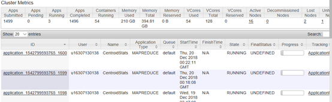

上图三个任务从上到下依次时100、1000、10000个中心点，截图的时间为最上面的Job开始后2min，可以看到他们的速度差异时积极显著的（越下面的job开始时间越早）。

### 2. 阈值的设置问题

阈值的设置和随机点的生成以及后续的聚类和判断都有关系，阈值对算法的影响也比较大。除去论文对阈值的分析外，本项目针对阈值也进行了简单的测试。阈值的设置如果过大，会导致中心点生成数据无法保证，而如果过小，又会造成生成的pairs过多。

### 3. 优化方向

1. 首先是随机点生成的优化，可以采用类似于similarity search的分区的思想，前面已经提过
2. 其次是分区时可以改进原本的Niave分区算法，使用最近邻搜索算法或Hash算法，找到某一个点所属的分区。一种比较合适的算法时GeoHash算法，它在地图搜索中有大量应用，与本项目面对的场景很像。
3. 再者就是Compress可以通过调节粒度以及分类标准获得更佳的效果。

## 九、 分工

- 集群搭建 常朝坤
- 项目架构设计 何畅扬
- 基础算法实现 何畅扬
- SecondaryKey设计 前期何畅扬，后期常朝坤
- Repartition 何畅扬 曾瑞莹
- Compress优化 常朝坤
- 数据搜集与整理 常朝坤
- 项目运行与测试 常朝坤
- 报告书写 何畅扬 常朝坤
- PPT制作 何畅扬

## 十、 参考文献

1. Scalable All-Pairs Similarity Search in Metric Spaces

2. <https://www.cnblogs.com/datacloud/p/3584640.html>

3. <https://blog.csdn.net/c_son/article/details/43900503>

4. http://www.aboutyun.com/thread-9353-1-1.html


